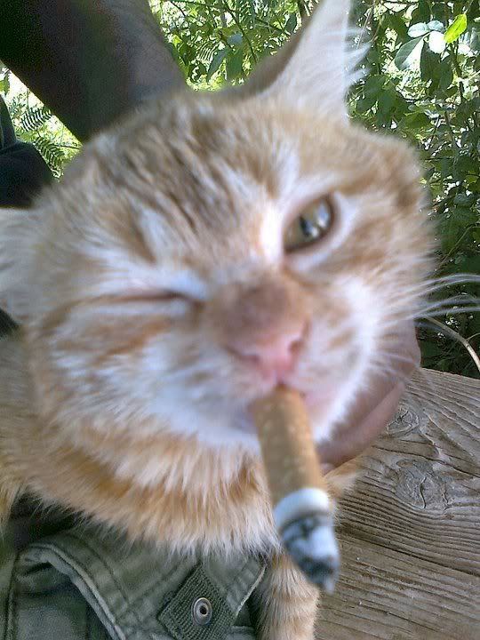
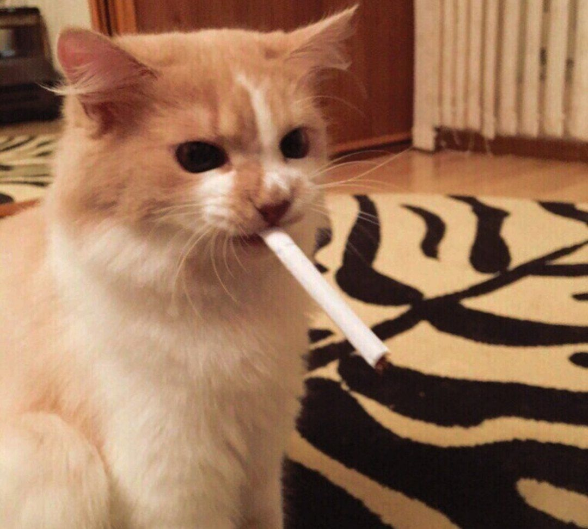

 

# noengine 

 

the best most skibidi engine ever written in the BEST and most rizzler language EVER c++ 

 

## Features 

 

- ai!! 

- more ai! 

- did i mention ai? 

- to be honest idk what this thing has im being forced to make this :( 

 

## word of our users 

 

 

 

> "after using this game engine i can conclude that any other engines are inferior and this is truly the only valid option for modern game development"
- an avid user of ours 

 

 

 

> "this game engine could be considered a blessing one as true as the invention of the second day of Christmas, words can't describe how good it feels to use this. One might even compare the usage of this language to eating a lollipop whilst wearing a propellor hat"
- a well acclaimed game engine critic  

 

 

 

> "meow meow meow? meow meow! mroew1! meow meow!! meow meow meow meowwww meooowww meow!"
 - the most avid user of ours 

 

## Installation 

 

Install this engine! 

 

you cant yet but look at this cat! 

 

 
